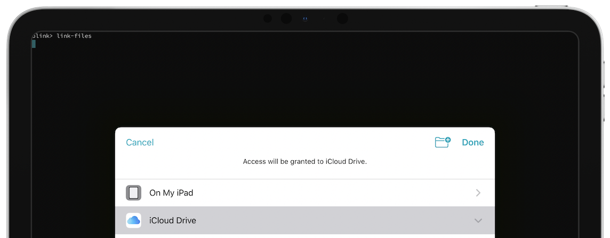

# UNIX Command Line Tools Roundup

## Introduction

Most users use Blink Shell to access remote machines, but many don't know that beneath our easy to use interface lies a robust set of command-line tools that would impress even the most proficient UNIX graybeard.

Ever wanted to diagnose a network issue? Sure, there are applications with fancy GUIs for running network analysis, but any UNIX veteran knows that tools like `ping` and `dig` are quick and powerful. Want to search through and manipulate your files? `grep`, `awk` and `sed` have you covered. Transfer your command line wizardry to your phone or tablet with Blink Shell.

You can see all the applications at your disposal by pressing `TAB` on the shell prompt.

## File Utilities

iOS limits you to a sandbox, but you can make the most of this by linking files from other locations on your device like iCloud. Simply run `link files` to bring up a dialog allowing you to select the folder to connect to Blink Shell.



Once you've linked the desired folder you're ready to go. Want to make folders in iCloud? No problem,

```bash
mkdir docs
```

You can even move files in the cloud with ease,

```bash
mv *.pdf docs
```

Need to find a particular file? Use the power of `grep`:

```bash
grep -nHr TERM LOCATION
```

We have even included `sed` and `awk`! `sed` is short for stream editor and it allows you to edit text inline, while `awk` is a superb data reporting and extraction utility.

For exmaple, with `sed` we can remove any string of characters, in this example we will locate and remove `aoe` from our file to then form a new file:

```bash
sed -i 's/[aoe]//g' file
```

Need to replace all your potatoes with bananas? Don't worry, we all do that at some point. `awk` to the rescue!

```bash
echo "one potato two potato" | awk '{gsub(/potato/,"banana")}1'
```

If you want to learn more about `sed` and `awk`check [this](https://github.com/codenameyau/sed-awk-cheatsheet) fantastic cheatsheet.

Another typical scenario when using a shell is the extraction of a compressed file downloaded from a web browser like Safari. Blink Shell provides `tar`, `gzip` and `md5` to make this task a breeze.

```bash
md5 filename.tar
tar xfz filename.tar -C destination
```

Blink Shell provides far more utilities and here's a list: `awk`, `cat`, `chflags`, `chksum`, `compress`, `cp`, `diff`, `du`, `ed`, `egrep`, `fgrep`, `find`, `gunzip`, `gzip`, `head`, `link-files`, `ln`, `ls`, `md5`, `mv`, `pwd`, `rm`, `rmdir`, `sed`, `sort`, `tail`, `tar`, `touch`, `uncompress`, `uniq`, `wc` & `xargs`.

## Remote Transfer Tools

Blink Shell offers a lot of useful local functionality but Blink specializes in enabling remote connections and that strength is leveraged in our command line tools. Want to upload a LaTeX file or a generated PDF to your server or even download a file from a Linux machine into iCloud? We have you covered with `scp`.

```bash
scp file user@remotehost:remotepath
```

In this example, we will transfer a file named `file` to the server `remotehost` with the username of `user` to place it in the `remotepath` folder. `scp` accepts wildcards, allowing the transfer of mulitple files at once, but you can also `tar` the files for a better transfer experience.

Some servers only support SFTP, so it is also bundled into Bliink Shell. To connect to a server simpy run:

```bash
sftp user@remotehost
```

Once connected, you can run FTP commands like `cd`, `get` and `put`.

## Network Diagnotsics

The network commands built into Blink Shell can save your day. Have you ever needed to check if a server is up from your phone? Running `ping` will get the ball rolling, followed with `nc` for advanced diagnostics.

You'll also find helpful tools like `dig` and `nslookup` to troubleshoot DNS issues as well as the `ssh` command for complex SSH connections and testing.

Have a little downtime? Have some retro fun with `telnet`:

```bash
telnet towel.blinkenlights.nl
```

We provide a full set of network utilities, including: `dig`, `host`, `nslookup`, `ssh`, `mosh`, `nc`, `ping`, `rlogin` and `udptunnel`.

## Miscellaneous

Blink Shell includes a few extra tools designed to make your mobile life easier.

Perhaps the most essential command is `geo`. This takes advantage of the device tracking functionality in iOS to keep your SSH connections running in the background. Don't worry, your location data won't be sent to Blink. In fact, it isn't sent anywhere.

To enable `geo`, run:

```bash
geo start
```

To enhance the security of your SSH sessions you can run:

```bash
geo lock
```

This will disconnect all active SSH connections if the device is moved.

Put the clipboard to use on your mobile device with `pbpaste` and `pbcopy`. Use the `pbcopy` command to put the contents of a file into the clipboard and `pbpaste` to paste the data. You can even use the `touch` command to create an empty file and paste it with `pbpaste` clearing your clipboard.

To open a file just run:

```bash
open filename
```

and a dialog will show asking which application to use to open the file.

Finally, use the `openurl` to launch a website. This is extremely powerful when paired with tools like `xargs` to open multiple URLs at once.

```bash
open url
```

This whirlwind tour of the Blink Shell just scratches the surface of what you can do with Blink. Go ahead and put your command line chops to use with our innovative command line interface to unlock a whole new world of mobile functionality.
