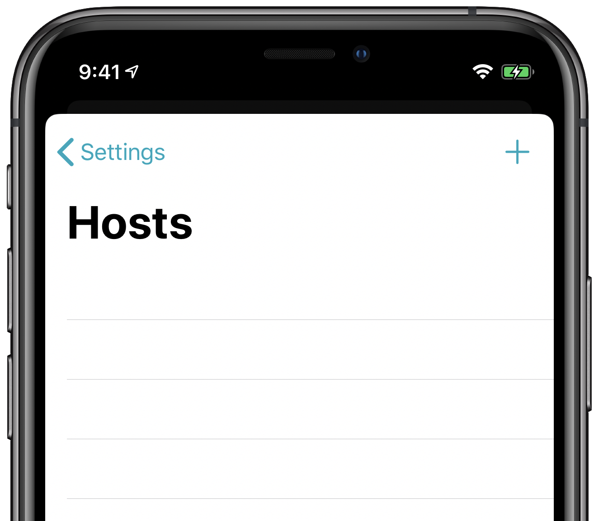
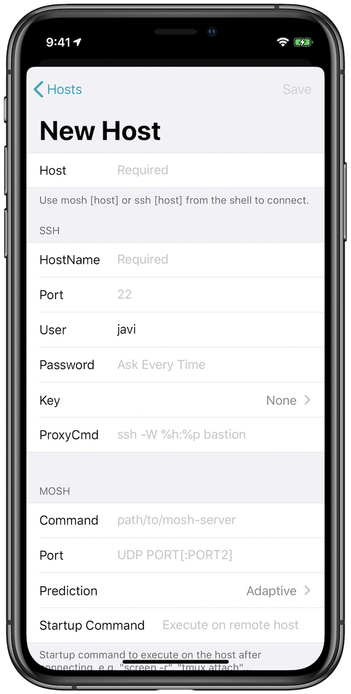
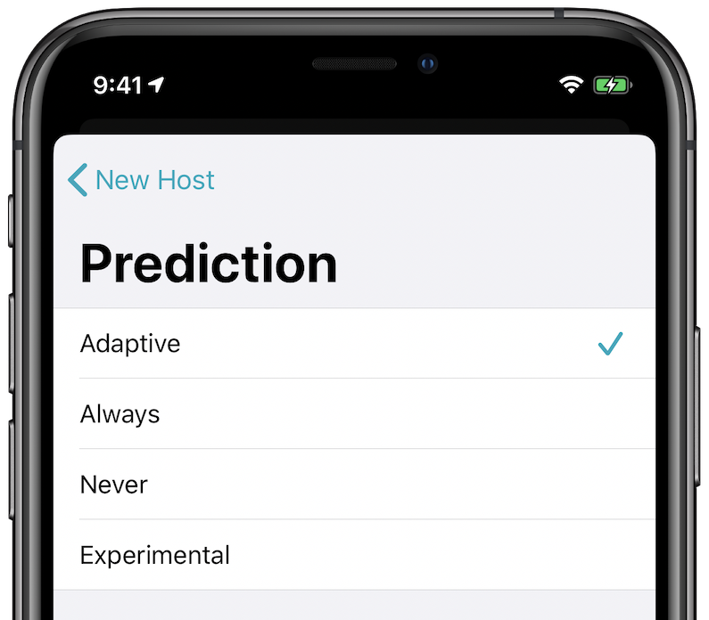
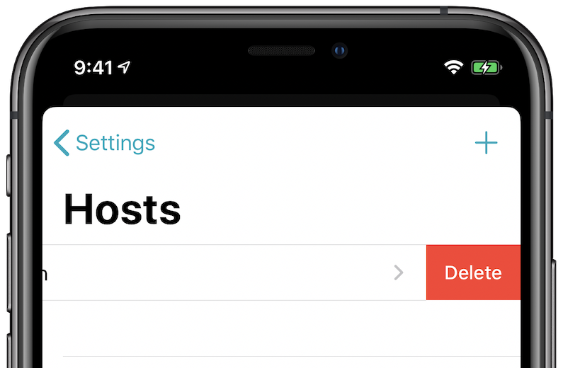
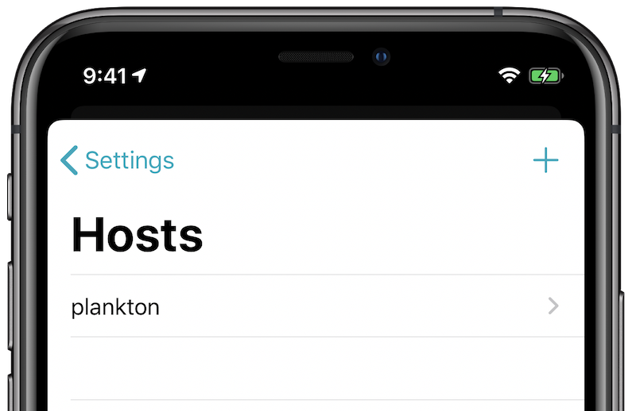

# How to Create and Access Hosts in Blink Shell

## Overview

The purpose of this guide is to show you how to pre-configure hosts for a simpler and more secure access. It is time consuming to type the same IP address, username and possibly password repeatedly, so we added the Hosts feature in Blink to allow this data to be saved for easier use.

## Adding a Host

When accessing the Hosts section in the configuration pane of Blink, you will be presented with a list of existing hosts. If this is your first time using this section it will be empty.



To add a host, click the `+` sign. When you do, you’ll be prompted for the details of that host.



### Host

This is the name of the host. Use this for easy identification in the lists of hosts. It does not necessarily have to match the hostname or IP address of the host.

### Hostname

In this field, please enter the hostname or IP address of the remote host.

### Port

In most cases this will be `22`, the default SSH port. If the host requires a different port number (`1`-`65535`) please enter it here.

### User

This is the username to connect with on the remote host.

### Password

If using password-based authentication, enter the password here. If you leave this blank and you don’t have a key for this host you will be prompted for the password each time you connect. If you choose to save a password, it is stored securely in the iOS Secure Enclave.

### Keys

To use public key encryption, select your key in this box. By default, the key named `id_rsa` will be used.

### Mosh Parameters

If you wish to use Mosh, you will have to supply additional parameters.

#### Server

The route for the `mosh-server` command on the destination server. In most cases this will be `/usr/bin/mosh-server` but on some remote systems, like macOS, the binary may be located in `/opt/bin/mosh-server`. You can check where is it located on the server using the `which` command as shown below,

```bash
which mosh-server
```

#### Port

If you need to specify a UDP port for Mosh, please enter it here.

#### Prediction



When you are finished with the parameters tap Save.

## Changing or Deleting Host

If you wish to change a host, tap on it in the hosts lists. Alternatively, to delete a host slide to remove it.



## Using Hosts

Once you have saved a host, you use the name you provided in the Blink Shell console:

```bash
mosh plankton
```

To use the host named `plankton` use the hostname that you specified in your command.



Command line parameters always have preference over configuration. You can redefine a parameter by specifying it on the command line. For example, to use a different user (in this case, `root`), specify:

```bash
mosh root@plankton
```
