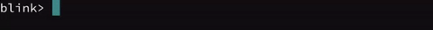
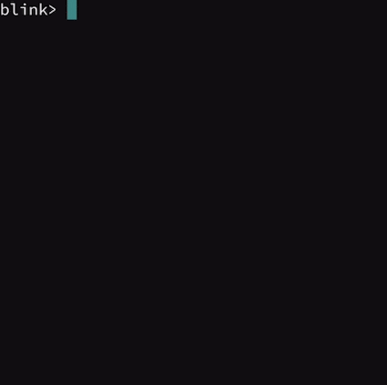
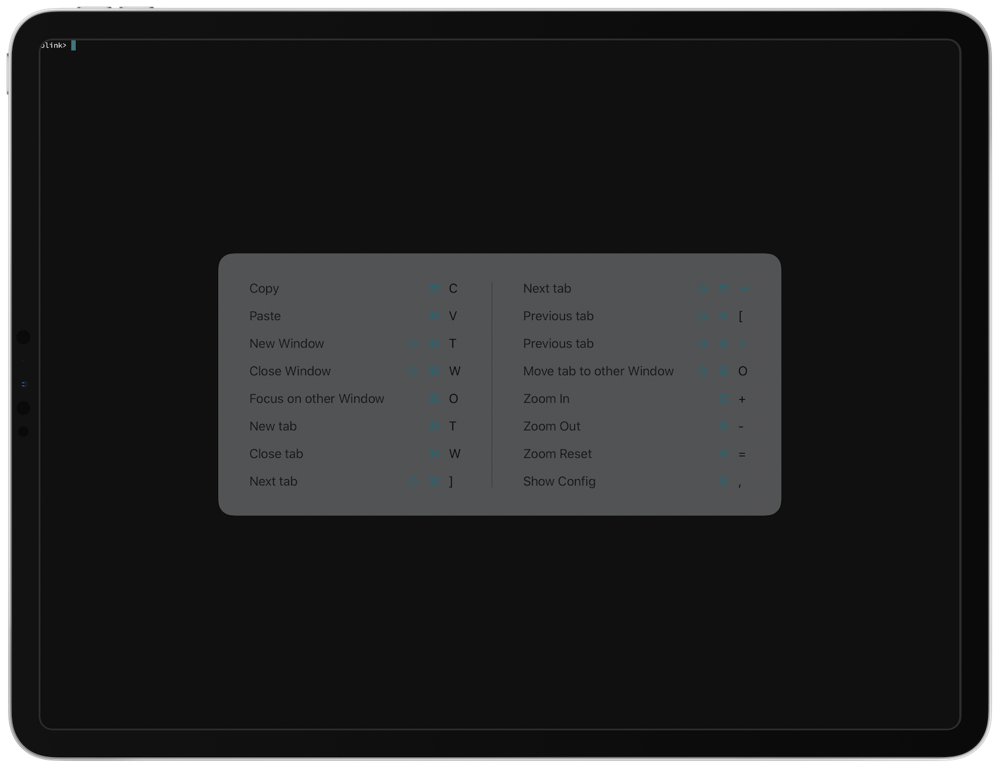
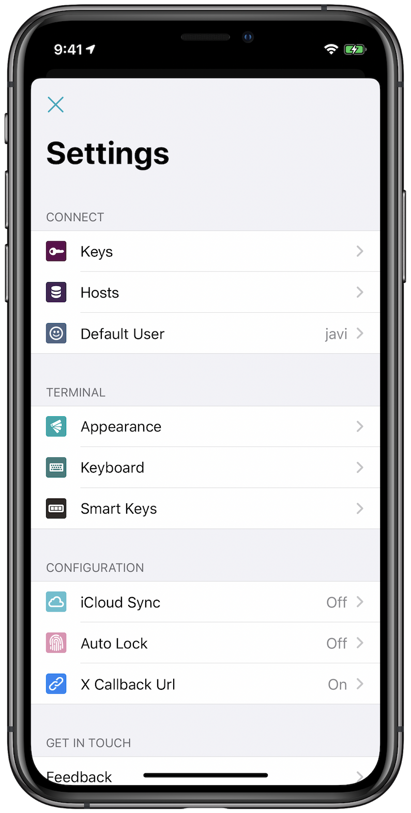

# Navigating the Blink Shell

## Introduction to Blink

Blink is a shell that allows you to connect to remote machines, use Mosh and has full SSH support. You can use it to connect to other servers, interface with your Raspberry Pi or even write code! The shell is ready to go, blinking with anticipation as you discover its potential.

## Using Blink Shell

Using Blink Shell is similar to most other terminals - you simply type commands and hit the `RETURN` key. Just like in Bash or similar UNIX shells you can press the up arrow to access the history of previous commands. You can type the `help` comamnd to access Blink’s online help, `mosh` to access the mosh mobile shell, `ssh` to connect via SSH or `ssh-copy-id` to copy SSH keys.



For example, you can type:

```bash
mosh carlos@192.168.1.5
```

To connect to your desktop computer or Raspberry Pi (assuming `192.168.1.5` is the IP address of the device and `carlos` is your username).

## Blink Shell Gestures

You can use a variety of finger gestures with Blink Shell. To create a new shell, you can tap the screen with two fingers. Swiping with one finger from side to side will move between active shells. You can control the size of your terminal by pinching the screen. Finally, tapping the screen with three fingers will open a contextual menu where you can close a shell and to configure the display modes for the current one.



## Blink Shell Keyboard Shortcuts

Blink Shell can also be easily used with keyboard shortcuts along with the finger gestures mentioned before. If you have an external keyboard attached or connected via Bluetooth press and hold the `CMD` ⌘ key to see the available shortcuts.



## Blink Shell SmartKeys

SmartKeys provide special keys to use in your terminal session. They are hidden when an external keyboard is connected and they show up when you use the software keyboard.

- Modifiers (i.e. `CTRL` ^, `ALT` ⌥, and `ESC` ⎋) for key combinations like `CTRL`+`C`.
- Directional arrows
- Scrollable area in the center with more keys
- Alternate keys after taping `CMD` ⌘ (function keys on central area plus cursor keys like Home, End, Page Down and Page Up)
- Holding a modifier instead of tapping allows you to chain multiple combinations, which is specially useful in applications like Emacs where you use chains like `C-x`, `C-c`.


## Configuration



To open the configuration section, type `config` within Blink Shell or press `⌘-,`. In the configuration section, you can configure the following:

- **Hosts**: Create hosts in your `~/.ssh/config` and access them just with the hostname. [More info](../basics/hosts.md).
- **Keys**: Create SSH key pairs for enhanced security and password-less convenience when accessing your servers. [More info](../basics/ssh-keys.md).
- **Appearance**: Personalize the terminal to your taste. You can change themes, fonts, or even upload your own.

## Support and Community

We sincerely appreciate your support and use of Blink. You can contact us via [email](mailto:hello@blink.sh) but ideally it is best to file issues on our [GitHub](https://github.com/blinksh/blink/issues) so that all of the community is aware of the issue. Not only does it help make Blink better but another user may help you solve your issue. When reporting a problem, please give as much detailed information as possible describing what you were doing when the application crashed or acted unexpectedly. Screenshots usually help when there is a problem with the interface.

**VERY IMPORTANT: Reporting a problem in your review in the App Store will not help us solve issues that you might be experiencing. Please make sure to contact us too!**

When a crash occurs in the application we receive a crash report. When this happens, please [email](mailto:hello@blink.sh) us or open an issue on [GitHub](https://github.com/blinksh/blink/issues).

If you have an idea for a feature? Join our community on GitHub to send us your suggestions! We want to make Blink the most awesome terminal ever!
