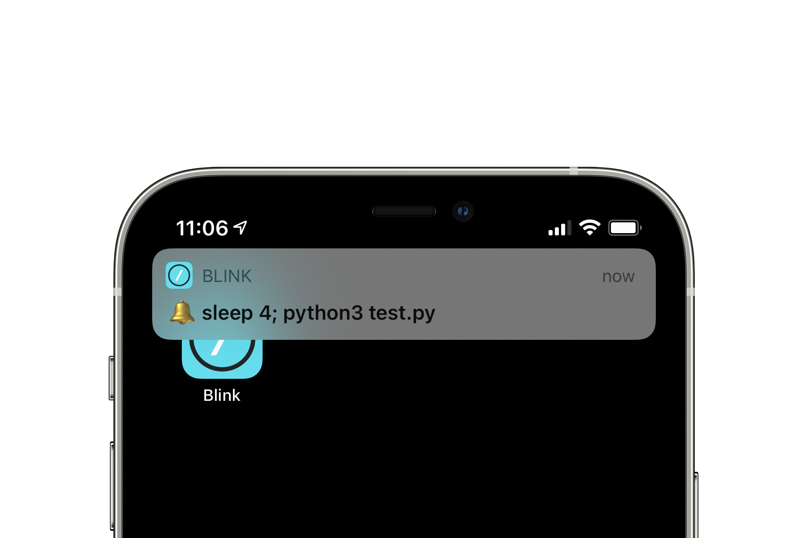
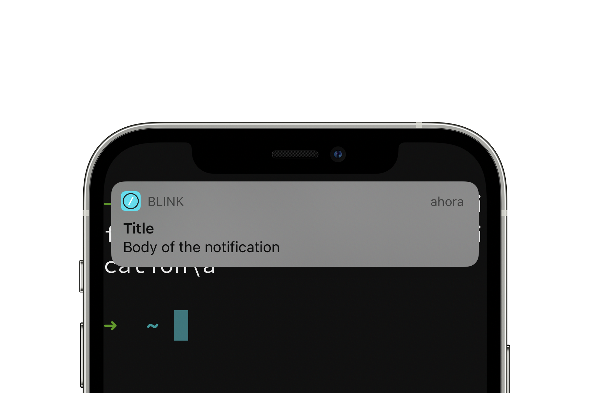

# Notifications

Have you ever glanced at your terminal multiple times to know whether your script has finished? Blink has your back here. Use terminal notifications to monitor the status of long running processes or to just know when something has finished. Level up your mobile shell experience with this feature.

All of the available options can be configured from the settings pane, open it by using the `config` command or pressing `CMD + ,`. These can be configured as granularly as you want with the following options:

* **Play Sound on active shell**: Plays an audible beep every time a `BEL` character is received.
* **Notification on background shell**: Display an alert when a `BEL` is received if the terminal is in the background or out of focus.
* **Use haptic feedback**: Only available on iPhones, vibrates the device when a `BEL` character is received.
* **'Notify' notifications**: Blink supports standard OSC sequences & iTerm2 notifications. Be notified whenever one of these sequences is received.

There are some examples in the settings you can copy and paste on a session to get you started.

## Bell notifications

How can you use this feature to improve your shell experience? Let's say you have a long test suite or program you have to execute. Wouldn't you want to be notified when either of those finishes? By simply printing out the `BEL` character at the line you want to be notified it's good to go. One simple example you can try is the following.

```bash
echo "Waiting to finish"; sleep 2; echo -n "Done!\a"
```

Once this `BEL` character is received you will receive a notification on your device.

<div style="text-align:center">
	
</div>

You can also trigger this beeping sound by also sending a `BEL` character using control-G (`^G`) just to try it out.

## OSC Sequences

If you want to get this to the next level and craft more complex notifications let's dive into OSC sequences.

Blink shell includes support for Operating System Command (OSC) escape sequences. These are typically initiated with `ESC + ]` (`\033]`), delimited by `;` and terminated with a [`BEL`](https://en.wikipedia.org/wiki/Bell_character) (`\07`) character. Whenever a text containing these parameters is printed out it will trigger a notification and can be displayed on your device. 


These OSC sequences can be customized using different [arguments](https://chromium.googlesource.com/apps/libapps/+/a5fb83c190aa9d74f4a9bca233dac6be2664e9e9/hterm/doc/ControlSequences.md#OSC). We're gonna look into two to display rich notifications.

The first argument for these OSC sequences, `9`, is an iTerm2 Growl notification. This displays a given message and the formatting is as follows,

```bash
echo -e "\033]9;Text to show\a"
```

<div style="text-align:center">
	
</div>

The last argument is a good option to display the text you like. It can even be some result after the execution of a script of your choosing. 

Another OSC sequence `777`, supports the `notify` argument and can display both a title and body. This resembles a system notification you would have received on another app. Try and create one of your own using the next example.

```bash
echo -e "\033]777;notify;Title;Body of the notification\a"
```

<div style="text-align:center">

</div>


## Considerations

Bear in mind that **some sequences are not supported in Mosh**.

When Blink is sent to the background the system can kill the remote connection after some time. This is done by the system depending on different conditions. To avoid this and persist the SSH connection and receive these notifications after a while, use the [`geo` command](https://blink.sh/docs/advanced/advanced-ssh#persistent-ssh-connections-with-blink). It bypasses the system's background resources and leaves you with a better notification integration experience. Not doing this doesn't guarantee your session will stay up as long as necessary.