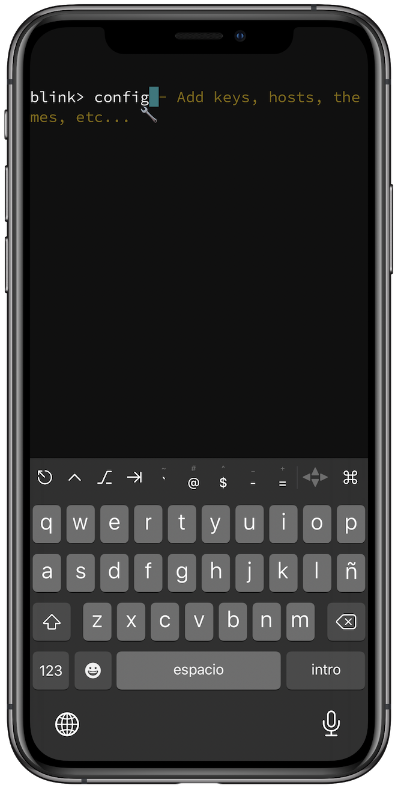
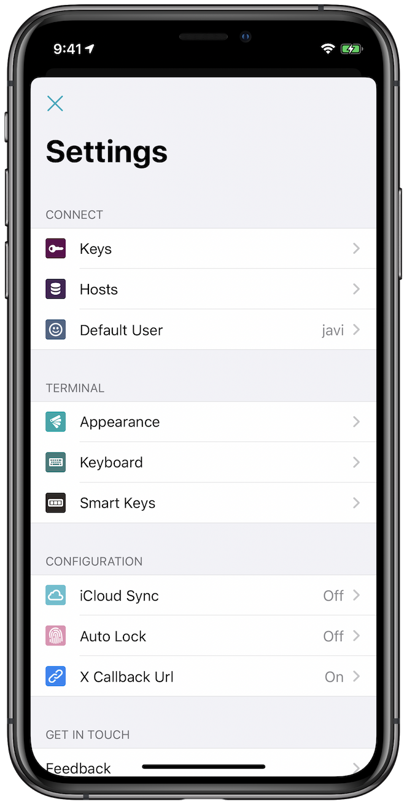
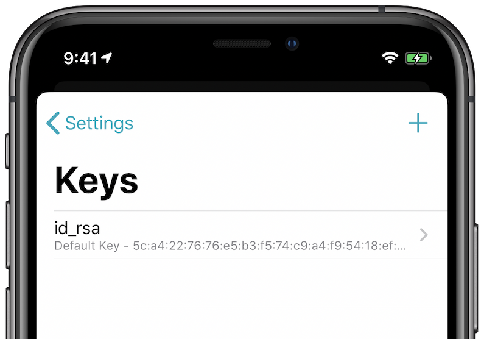
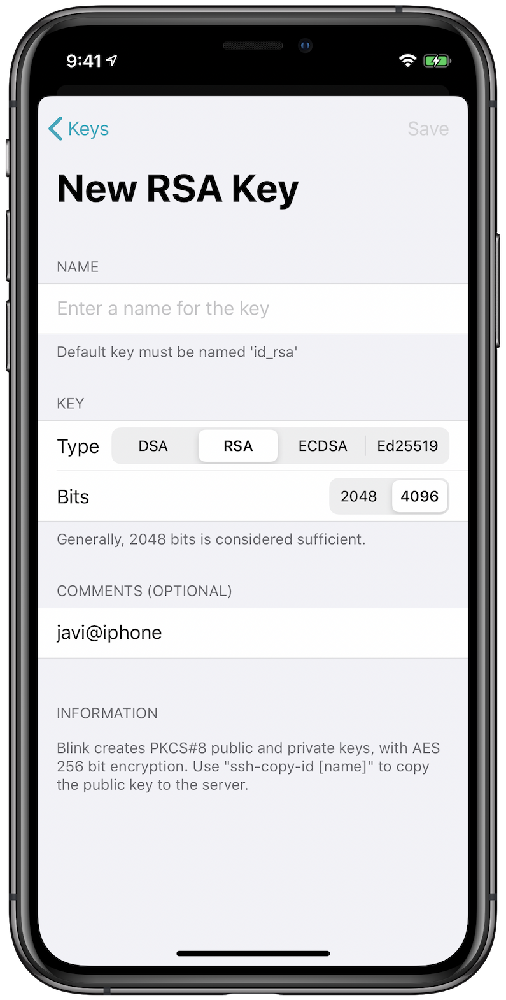
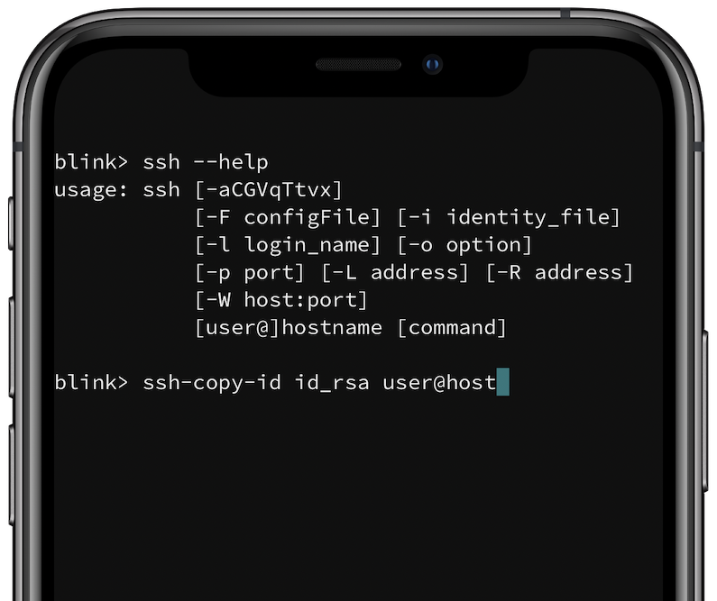

# Using SSH Keys with Blink Shell for iOS

## Summary

This article will give an overview of what SSH keys are and describe how to use them in Blink.

## About SSH Keys

SSH Keys are small text files meant to be exchanged in lieu of passwords for verifying access to a remote server. A SSH key consists of two parts: a public and a private key. The public key is what resides on the remote server and the private key is stored on your local device. The public key is not a secret but the private key should never be shared with anyone nor uploaded to any untrusted location.

Using SSH keys is more secure than passwords as they are more difficult to crack compared to typical passwords. For example, using standard computing power it may take over a million years to crack an SSH key, but a standard password will take far less time to compromise. Additionally, SSH keys are more convenient as you don’t have to type your password in each time you want to connect to a remote server.

## Using SSH Keys in Blink

Before you can use SSH keys you must generate or import a keypair. In this article we will discuss generating a keypair. To get started, run the `config` command in Blink Shell to access the configuration pane.



Once that is done the Settings dialog will open as shown below:



Click on the `Keys` button to enter the SSH keys menu.



In the above example we see that there is a default key named `id_rsa`. The default key is always named `id_rsa` and this will be the key used first to authenticate. You can have multiple SSH keys to connect to multiple SSH servers. To create a key, click the `+` icon at the top and you will be presented with the New Key dialog as shown below:



Blink creates a default key named `id_rsa`. If you wish to create another key, please give a descriptive name of your choosing. As a suggestion, if you are going to generate a specific key pair for access to a specific server, we would recommend naming the key the hostname of that server so that's easy to remember in the future.

By default, Blink Shell suggests RSA keys which have been the standard for years. Nowadays other types of keys based on other mathematical problems like elliptic curves are becoming a trend. If your server supports it, you can create an ECDSA or Ed25519 key. For RSA keys, a 2048 bit key is probably large enough, but you can even choose a 4096 bit key for extra security if you desire.

If you wish, you may provide a passphrase for your key. This will encrypt the private key so that if it is ever compromised it will not be useable without knowing the passphrase. An SSH connection is still encrypted and secure if you choose not to protect your key, but if you do, you will ensure an extra measure of security. Keep in mind that the encryption of your private key is only as good as the passphrase you choose to use. You can use a website like [How Secure is My Password](https://howsecureismypassword.net/) to determine the strength of your passphrase.

Blink stores your private key on the iOS Keychain, which is quite secure as it is protected through Secure Enclave. So even if you choose not to protect your private key with a passphrase, it is still stored in a secure area on your device.

## Adding a Public Key to a Remote Host

The Blink command `ssh-copy-id` command can be used to copy the public key to a remote host. This will effectively install the key for use in your connection to that server. The syntax of the command is:

```bash
ssh-copy-id identity_file user@host
```

The `identity_file` argument is the name of your SSH key pair. The `user` is the remote username, and the `host` is the remote hostname. You may also specify an IP address instead of a hostname.



## Establishing a Connection Using SSH Keys

There are two different ways to establish a connection to a remote server - via SSH or via Mosh. SSH will work in all cases, but if Mosh is available it is preferred for mobile devices or internet/network connections that may encounter high latency or frequent disconnects.

To connect via SSH:

```bash
ssh user@1.2.3.4
```

In this example, an SSH connection is established with the username user to the remote IP `1.2.3.4`. You may also specify a hostname instead of an IP address. Since no key was specified, the default key `id_rsa` will be used.

```bash
ssh -i your_key myhost
```

In the above example, the key `your_key` is used to connect to the pre-defined host `myhost`. You can add pre-defined hosts in the Hosts section of the application. 

To connect with Mosh, the syntax is mostly the same:

```bash
mosh -I your_key host
```

In this example, `your_key` is the SSH key to use, and `host` is the host entry to use in the connection.
