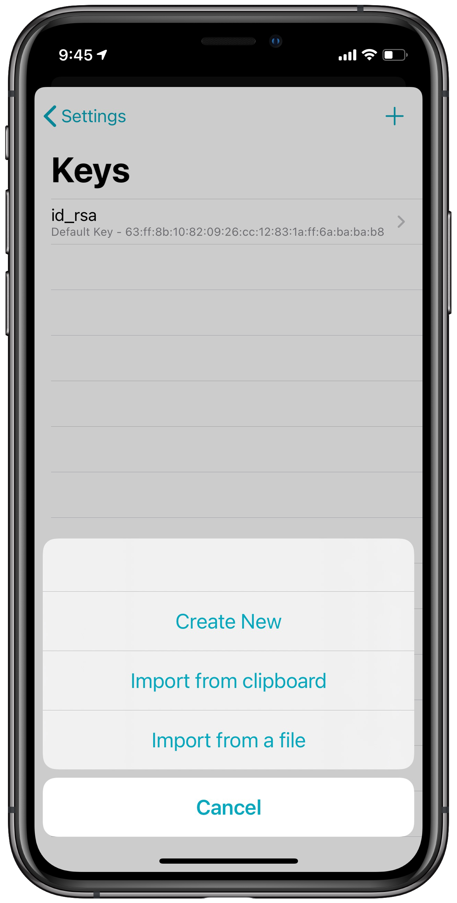

# Connecting to your AWS EC2 Instance with Blink

## Introduction

We could make a convincing argument that Amazon popularised, if not invented, the cloud computing movement. By offering servers, storage and other computing services, priced by the hour and accessible via an API, Amazon started a new phase in Internet computing. In just fifteen years, Amazon has gone from ma pie-in-the-sky idea by visionaries at the company to a large public utility that powers a substantial portion of the Internet.

[EC2](https://aws.amazon.com/ec2/), or **E**lastic **C**ompute **C**loud, is the virtual server offering of AWS. Customers can launch a wide variety of Linux and Windows instances with EC2, each running a full copy of the operating system backed by Amazon's highly reliable infrastructure. EC2 instances operate much like regular servers, except resources like CPU and memory can be changed with a simple reboot. Disks for the instances are powered by [EBS](https://aws.amazon.com/ebs/?ebs-whats-new.sort-by=item.additionalFields.postDateTime&ebs-whats-new.sort-order=desc) (**E**lastic **B**lock **S**torage), a technology that allows easy disk management. Volumes can be resized and scaled with a click of the mouse.

Let's guide you through the process of launching a Linux EC2 instance in the AWS cloud and connecting to it with Blink.

## Creating an Instance

Sign in to your AWS account, then check in the top right corner on the menu bar between your account's name and support to ensure you're in the right datacenter region. You're free to use any datacenter in the world, but it's best to select the location that's closest to your customers or you for reduced latency.

<p align="center" >
  
</p>

Once you've selected the most appropriate region, click on the Services menu at the top, then pick EC2 under Compute to bring up the EC2 dashboard. You might have to type EC2 in the search box for the link to be visible.

<p align="center" >
  
</p>

Click on instances under the Instances group on the left-hand menu to see a full list of your instances. On a new account, you won't find any. Click Launch Instance to start with the process.

<p align="center" >
  
</p>

Then select your [AMI](https://docs.aws.amazon.com/AWSEC2/latest/UserGuide/AMIs.html) (Amazon Machine Image) which is simply a disk image that contains an operating system. In the Quick Start section, you'll find a list of common available systems, like RedHat Enterprise Linux, SUSE Linux, Amazon Linux, Microsoft Windows Server and Ubuntu. Since we're connecting to a Linux Server, let's choose Ubuntu.

<p align="center" >
  
</p>

On the left pane select Instance Types under the Instances menu. You will be shown a complete list of all of the available machines you can pick from. For testing and development purposes, the [t2](https://aws.amazon.com/ec2/instance-types/t2/) and [t3](https://aws.amazon.com/ec2/instance-types/t3/) are generally adequate. Once you've made your selection click next to Configure Instance Details on the bottom right part of the screen. The defaults on this page are likely fine, but you now have the opportunity to make changes to your default configuration. When finished click next to bring Add Storage menu.

<p align="center" >
  
</p>

Now it's time to pick the size, in gigabytes, of the root drive for your instance. For testing purposes the default size, usually 8 GiB, is fine. You can resize later if needed. Then click next, Tags. If you wish to label this instante for a particular project or customer, you can add a name/value pair calle da tag. It's recommended to create a tag called `Name` and give it the value of the intended hostname. Once you've finished click next: Configure Security Group.

If this is a new account or you don't have an existing infrastructure at AWS, you will be prompted to create a new security group. Assign it a meaningful name, then add any open ports you will need. At a minimum you'll need SSH (port `22`) open to your IP. Alternatively, if you want to use Mosh you'll need to allow UDP traffic on ports `60000` to `61000`.

<p align="center" >
  
</p>

To open a port, select the type of port (i.e. SSH, HTTP, HTTPS...) or if none matches pick a custom TCP or UDP port and add the number of range of ports in the Port Range box. The destination can be set to anywhere if you wish the port to be open to all IP addresses, or set to a custom IP or My IP, a shortcut provided to automatically fill in your current IP address. Note that IP addresses must be entered in [CIDR](https://en.wikipedia.org/wiki/Classless_Inter-Domain_Routing) format (i.e. `1.2.3.4/32`) for a specific IP, and `1.2.3.0/24` for a Class C range). Once you've whitelisted any ports and IP addresses, click Review and Launch.

You'll now see a detailed list confirming all of your selected options for the new instance. If everything's okay click Launch. After that, you can generate a new public/private key pair or choose an existing pair previously imported into AWS. If you create a new one you'll be prompted to save the private key file. You must have this file to connect to your instance, so you'll want to keep it safe. We will explore how to import an Amazon generated private key inside Blink.

The instance will launch once you confirm the SSH key. Within minutes you'll be able to use your new EC2 instance.

## Managing log in with keys

We recommend using a public/private key pair to log into any server as it's more secure than a traditional password. To import a key inside AWS to use later on in the process log into your account and click on Key Pairs under Network & Security in the left pane of your management console.

<p align="center" >
  
</p>

In the menu that's shown enter a name for the key pair and then paste the contents of the key you want to import. You can use any key created inside Blink Shell. To copy the contents of the public key open Settings by tapping `Cmd - ,` or writing `config` in the console. Then select Keys and choose or create the key you'll be importing. Then copy the public key's content and pasting it into the AWS's field. After this you will be able to log into your instance using a key pair from Blink Shell.

Alternatively, you can import an Amazon Private Key created from the dashboard. Importing keys into Blink Shell is as easy at it gets. Open the settings panel by either typing `config` in the shell or by pressing `Cmd + ,` if you have a keyboard attached. Select the Keys menu and press add (`+`) to import it using the assistant using the option that best suits you. For example you can copy it to your clipboard and then pase it into the assistant.

Remember that if you name your key a non-default name, `id_rsa`, you'll have to add the `-i <keyname>` flag to the SSH command.

<p align="center" >
  
</p>

## Accessing Your Instance

Click on Instances under the Instances group on the left-hand side menu, then select the instance you wish yo connect to with Blink. Right-click on the instance, then click Connect. The resulting page will show the SSH commands to use. If your key has already been added to Blink,  you can use the same SSH connection command to connect, like this:

<p align="center" >
  
</p>

```bash
ssh ubuntu@IP_ADDRESS
```

In the above example replace IP with the address of your EC2 instance. If you choose an Amazon Linux AMI, you'll want to change the user `ubuntu` with `ec2-user`.

## Conclusion

AWS powers a large portion of the Internet, so launching an EC2 instance inside Amazon's powerful cloud puts your server in good company with leading web brands. Blink's flexible command-line tools, including SSH, mosh and Rsync make managing your Amazon cloud server a breeze.