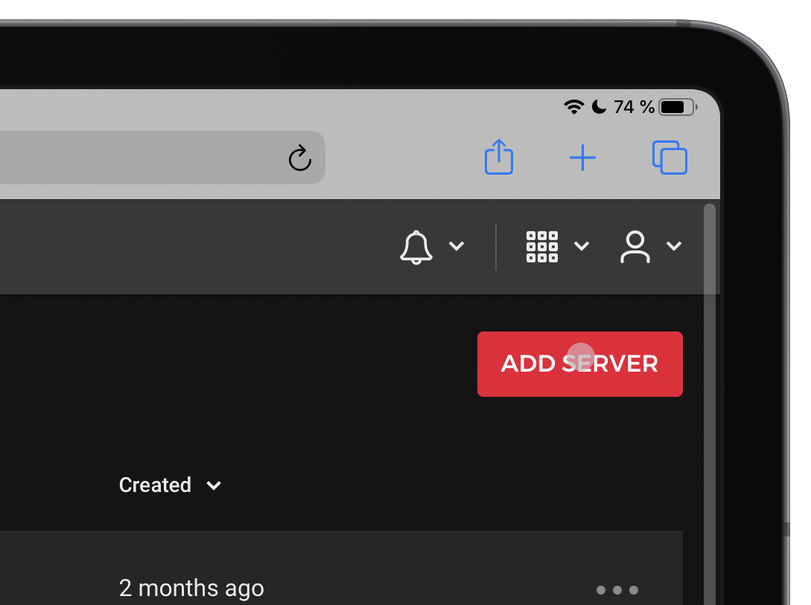
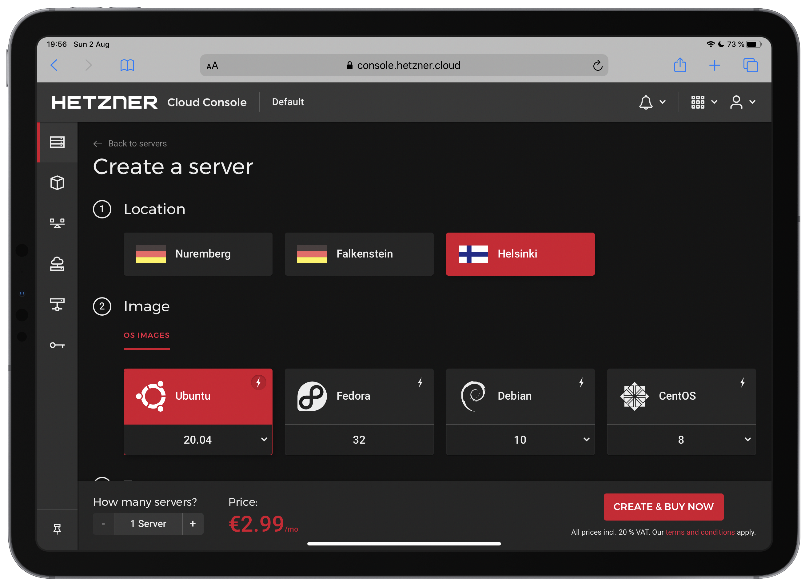
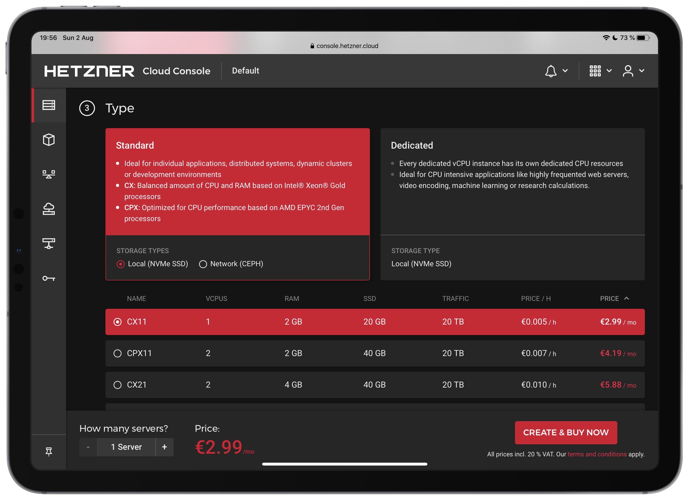
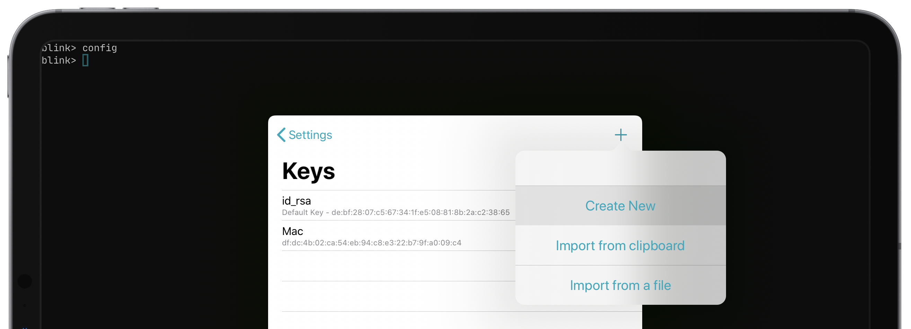
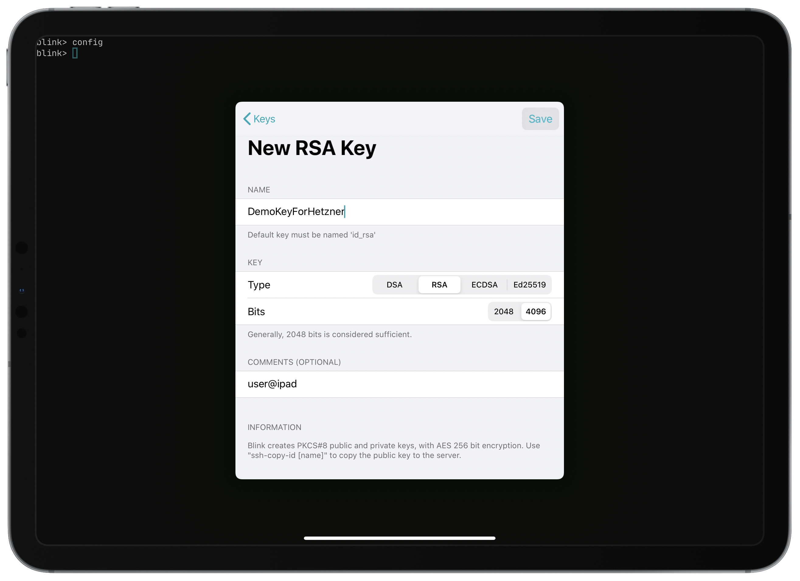
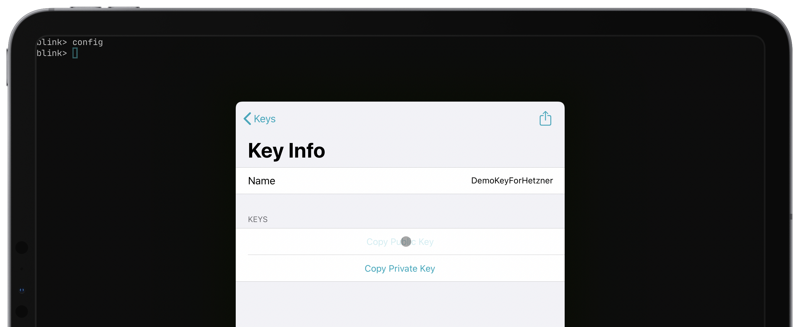
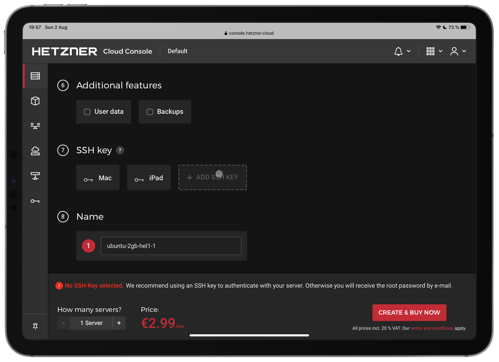
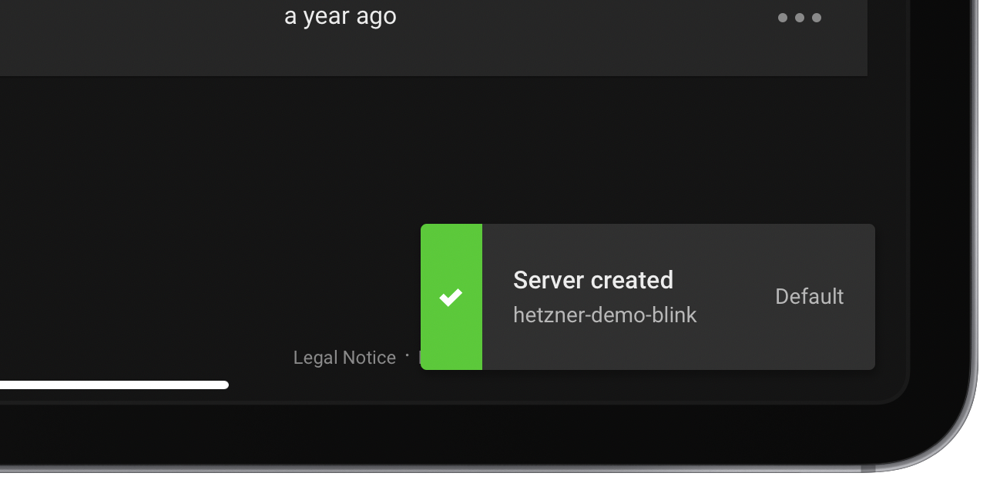
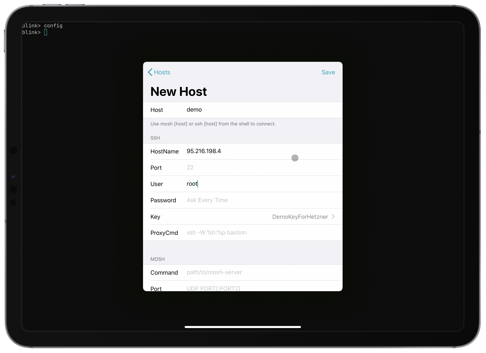
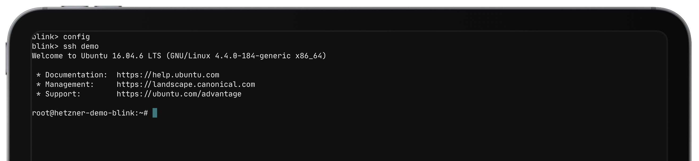

# Renting a VM/server from Hetzner for use with Blink

## Introduction

[Hetzner](https://hetzner.cloud) is a cloud provider from Germany offering hosting services from Germany and Finland. It is cheaper than DigitalOcean and less confusing than AWS. It also has direct connections to FICIX (Finland's Internet Exchange Point).

## Creating a VPS on Hetzner

First, you have to sign up. Go to [hetzner.com](https://hetzner.com), click Login in the top riht corner and select `Cloud`

After signing up, open the default project created for you by Hetzner and click on `Add server`



You will be presented with a few options for regions and Linux distributions. Select the closest region to you to make sure you have the least latency and pick your preferred distro.



Now you can select a server tier. Don't worry about underestimationg or overestimating your needs because you will be able to resize your server at any time.



After that, you will need to generate an SSH key to authenticate with your server. Open Blink and run `config`, select `Keys`, click the plus button and click `Create SSH key`



And give it a name



After that, copy the public part of the key and go back to the server creation page



Then, check the `Backups` box if you want your server to have backups if you mess up sometime in the future, add the SSH key and select it. Give it a cool name and click `Create and Buy Now`



Hetzner will begin provisioning your server - that shouldn't take more than a few minutes. When your server is created, you will see a notification



## Connecting to your VPS with Blink

Now that your VPS is created, you can connect to it with Blink. Run `config`, tap `Hosts` and tap the plus button. Fill in your server IP and select the SSH key created above. By default, Hetzner will create a user called `root` on your server



And finally, you can click save and connect to your server with the `ssh` command

```bash
ssh [host]
```


