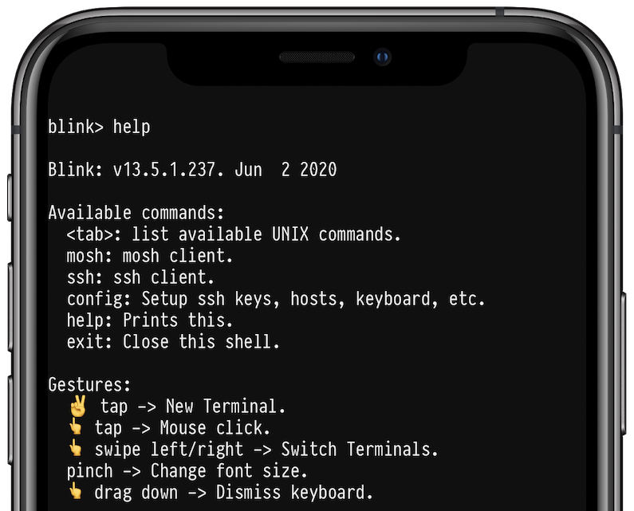
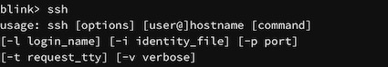
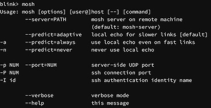
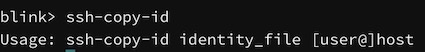

# Commanding Your Blink Terminal

## Overview

This guide will explain the various commands available to you inside Blink.

<<<<<<< HEAD
Each command has parameters, called arguments, that adjust the operation and behavior of that command. Any argument passed to a command will override its operation, even if those arguments conflict with any pre-existing configuration.

## In-App Help

If you type `help` in the Blink Shell terminal you’ll see an overview of the basics like the following:



### Config

If you type `config`, you’ll be presented with the configuration screen. From here you can adjust the application’s settings.

### SSH

The `ssh` command will allow you to start a secure remote shell to another device. The parameters to this command are as follows:
=======
Each command has parameters, called arguments, that adjust the operation of that command. Any argument passed to a command will override its operation, even if those arguments conflict with any pre-existing configuration.

## In-App Help

If you type help in the Blink terminal you’ll see an overview of the basics like the following:


### Config

If you type config, you’ll be presented with the configuration screen. From here you can adjust the application’s settings. Link

### SSH

The ssh command will allow you to start a secure remote shell to another device. The parameters to this command are as follows:
>>>>>>> 25dd0489951a6f4143e7b0945e98305352d7f077

```bash
ssh user@host
```

<<<<<<< HEAD
Where `user` is the username you wish to use, and `host` is the hostname (or IP address) of the remote machine to connect to. If you type `ssh` by itself you’ll see a simple usage guide that explains the other optional parameters:



The most common parameters you may need to specify are the port, identify file, and adjust the verbosity to debug connection issues.
=======
Where user is the username you wish to use, and host is the hostname (or IP address) of the remote machine to connect to. If you type ssh by itself you’ll see a simple usage guide that explains the other optional parameters:


The most common parameters you may need to specify are the port, identify file, and adjust the verbosity to debug connection issues. 
>>>>>>> 25dd0489951a6f4143e7b0945e98305352d7f077

```bash
ssh -i my_identity -p 1234 -vvv myuser@11.22.33.44
```

<<<<<<< HEAD
In the above example, a connection will be attempted to `11.22.33.44` using the username `myuser`, the identity file `my_identity` is used, port `1234` is specified, and extra debugging information will be displayed.
=======
In the above example, a connection will be attempted to 11.22.33.44 using the username myuser, the identity file my_identity is used, port 1234 is specified, and extra debugging information will be displayed.
>>>>>>> 25dd0489951a6f4143e7b0945e98305352d7f077

### Mosh

Mosh is a mobile remote shell that is better suited for mobile use. It allows for roaming and supports the intermittent connectivity that is commonly found on mobile devices.

<<<<<<< HEAD
Mosh has its own detailed set of arguments, however, for most common uses you’ll use a syntax similar to the ssh command:
=======
Mosh has its own detailed set of arguments, however, for most common use, you’ll use a syntax similar to the ssh command:
>>>>>>> 25dd0489951a6f4143e7b0945e98305352d7f077

```bash
mosh user@host
```

<<<<<<< HEAD
If you type `mosh` without any arguments you will see a full list of available options:



You can configure most Mosh options, including the startup command, in your host configuration. For more information, please see “Create and Access Hosts Using Blink Shell”.

An example of using Mosh in Blink Shell would be:
=======
If you type mosh without any arguments you will see a full list of available options:


You can configure most mosh options, including the startup command, in your host configuration. For more information, please see “Create and Access Hosts Using Blink Shell”.

An example of using mosh in Blink would be:
>>>>>>> 25dd0489951a6f4143e7b0945e98305352d7f077

```bash
mosh carlos@11.22.33.44
mosh plankton — tmux attach
mosh plankton — screen -r
```

<<<<<<< HEAD
In the above examples, the `--` parameter is used, which allows for running commands once connected without prompting first.

You’ll also notice that in the second and third example, the host `plankton` is used. You can define your own custom hosts with user, port, and identity key specifications defined per hostname. This reduces the amount of typing and commands you’ll need to execute to connect to a host.

### SSH Copy ID

With the `ssh-copy-id` command, you can copy your secure key to a remote server. It has the following format:
=======
In the above examples, the -- parameter is used, which allows for running commands once connected without prompting first.

You’ll also notice that in the second and third example, the host plankton is used. You can define your own custom hosts with user, port, and identity key specifications defined per hostname. This reduces the amount of typing and commands you’ll need to execute to connect.

### SSH Copy ID

With the ssh-copy-id command, you can copy your secure key to a remote server. It takes the following format:
>>>>>>> 25dd0489951a6f4143e7b0945e98305352d7f077

```bash
ssh-copy-id identity_file user@host
```

<<<<<<< HEAD
Where `identity_file` is the name of the SSH key you wish to copy, `user` is the username on the remote server, and `host` is the hostname or IP address of the server in question.



It should be noted that this command will require you to either have another key on the server or the password. If you aren’t being presented with a password prompt, please check on the remote server that SSH password authentication is turned on. Though SSH keys are more secure, it may be helpful to temporarily turn on password authentication so that you can copy your key to the machine.

While the exact procedure varies, on RHEL/CentOS, you would edit the `/etc/ssh/sshd_config` file and change `PasswordAuthentication` to `yes` and restart SSH via `service ssh restart` (or reboot).
=======
Where identity_file is the name of the SSH key you wish to copy, user is the username on the remote server, and host is the hostname or IP address of the server in question.


It should be noted that this command will require you to either have another key on the server or the password. If you aren’t being presented with a password prompt, please check on the remote server that SSH password authentication is turned on. Though SSH keys are more secure, it may be helpful to temporarily turn on password authentication so that you can copy your key to the machine.

While the exact procedure varies, on RHEL/CentOS, you would edit /etc/ssh/sshd_config and change PasswordAuthentication to yes and restart SSH via service ssh restart (or reboot).
>>>>>>> 25dd0489951a6f4143e7b0945e98305352d7f077

This command is a simple wrapper around the ssh command to facilitate easy transfer of SSH keys. If you need to specify a different port, you must create a host in your configuration.

## Other commands and tips

<<<<<<< HEAD
**Reverse Search.** Typing the same commands is repetitive and sometimes on a cramped phone keyboard the experience may not be the best. With `Ctrl ^-r` you can access your command history menu. Start typing parts of the command and Blink Shell will match and suggest as you go.

**SCP and SFTP.** Blink gives you the usual basic commands to copy and move files between your system and the remote. For example, you can type `scp file.txt user@remotehost:` to copy the `file.txt` on your local machine to the remote host. You can find more information about this command online.

**Basic UNIX toolbox.** Within Blink, we have embedded a basic UNIX toolbox. You will find some network operations like `ping` or `nc`, file operations like `mkdir`, `grep`, and even the small “popular” editor `ed`.
=======
**Reverse Search.** Typing the same commands is repetitive and sometimes on a cramped phone keyboard the experience may not be the best. With Ctrl ^-r you can access your command history menu. Start typing parts of the command and Blink will match and suggest as you go.

**SCP and SFTP.** Blink gives you the usual basic commands to copy and move files between your system and the remote. For example, you can type `scp file.txt user@remotehost:` to copy the file.txt on your local machine to the remote. You can find more information about this commands online.

**Basic UNIX toolbox.** Within Blink, we have embedded a basic UNIX toolbox. You will find some network operations like ping or nc, file operations like mkdir, grep, and even the small “popular” editor `ed`.
>>>>>>> 25dd0489951a6f4143e7b0945e98305352d7f077
